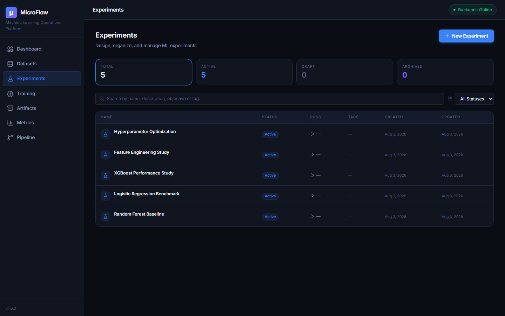
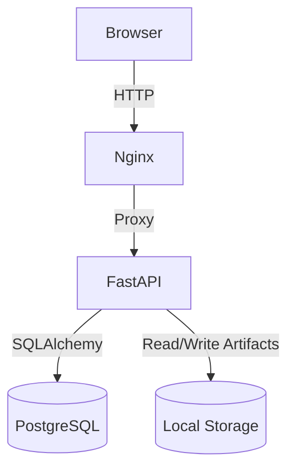
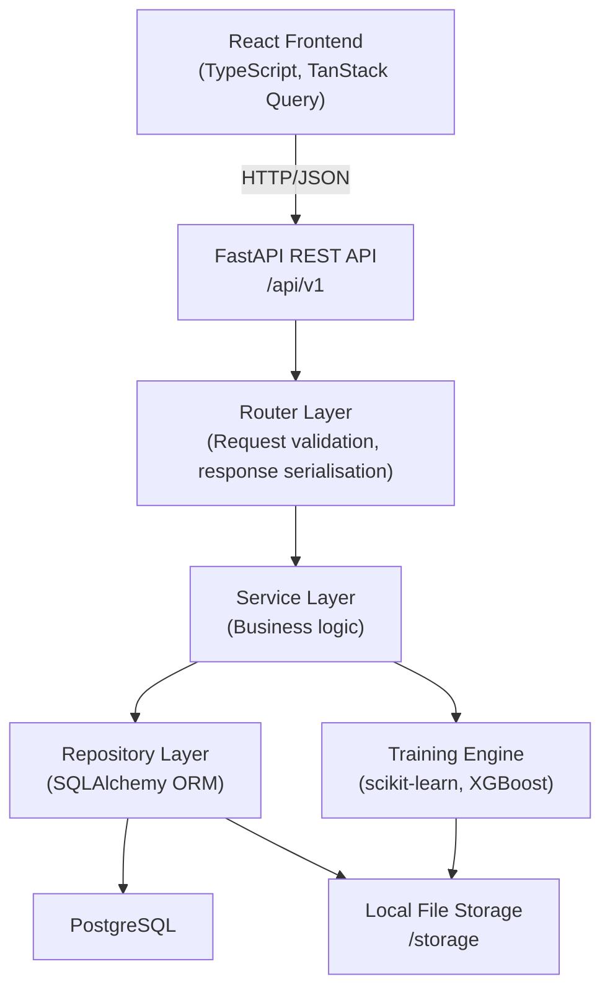
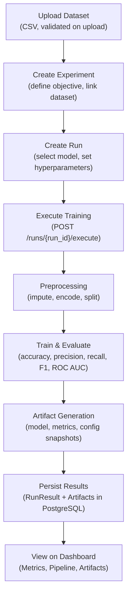
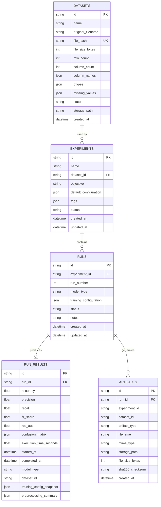

<div align="center">

# MicroFlow


<br>


<br>

<h3><a href="https://microflow-ml-platform.vercel.app">🌟 View Live Demo: microflow-ml-platform.vercel.app 🌟</a></h3>

</div>


**An ML experimentation platform built for computational biology workflows.**

### Current Features
- ✔ Dataset Management
- ✔ Experiment Tracking
- ✔ Run Tracking
- ✔ Training Engine
- ✔ Artifact Registry
- ✔ Metrics Dashboard
- ✔ Pipeline Visualization
- ✔ Interactive Dashboard

---

## Overview

Running one model once is easy. Running hundreds of experiments over several datasets, comparing results across model configurations, and reproducing a specific run six months later — that is the actual problem.

MicroFlow is an internal ML platform designed to solve exactly that. It handles the infrastructure layer of machine learning: dataset versioning, experiment definition, run tracking, artifact persistence, and metrics aggregation. The actual biology is your concern; reproducibility and traceability are MicroFlow's.

The platform is aimed at ML engineers, data scientists, and research engineers who need an organised, auditable workflow rather than a collection of notebooks and CSV files.

---

## Highlights
- ✔ Full-stack ML platform
- ✔ 188+ automated backend tests
- ✔ Dockerized deployment
- ✔ FastAPI + React
- ✔ PostgreSQL
- ✔ Experiment → Run architecture
- ✔ Artifact Registry
- ✔ Interactive Metrics Dashboard
- ✔ Pipeline Visualization

---

## Demo

A quick look at the platform in action.

### Dashboard


### Dataset Management & Experiments


### Training Operations


### Metrics Dashboard


### Pipeline Visualization


### Artifact Registry


---

## Why I built this

Modern ML projects quickly become difficult to reproduce as datasets, models, configurations, and evaluation results grow. MicroFlow was built to explore how an experiment tracking platform can be engineered from scratch using a layered architecture rather than relying on existing tools. 

---

## Why MicroFlow?

When ML projects move beyond a single experiment, three problems surface reliably:

**You lose track of what you ran.** Without a structured system, experiments accumulate in notebooks. Parameters get changed and forgotten. Results become disconnected from the code that produced them.

**You can't reproduce results.** If the preprocessing pipeline isn't captured alongside the model, retraining on the same data produces a different result. MicroFlow snapshots training configuration and preprocessing metadata with every run.

**Comparison becomes manual work.** Comparing five model configurations across two datasets requires a proper query layer, not a spreadsheet. MicroFlow's Metrics Dashboard provides aggregated, queryable analytics across all runs.

---

## Deployment Architecture



---

## Key Features

### Dataset Management
- Upload CSV datasets through the UI or API
- Automatic schema analysis: row count, column count, data types, missing value detection
- Dataset preview (first N rows) and per-column statistics
- SHA-256 deduplication — the same file will not be stored twice
- Datasets are versioned and protected from deletion if experiments depend on them

### Experiment Management
- Experiments define the ML problem: name, objective, linked dataset, and default training configuration
- Multiple runs can be grouped under a single experiment
- Experiment status lifecycle: `draft → active → archived`
- Per-experiment analytics showing best run, accuracy range, and model breakdown

### Run Management
- Each run is an individual training execution with its own model type and hyperparameter overrides
- Run status lifecycle: `draft → queued → running → completed / failed`
- Full audit trail: created timestamp, started timestamp, completed timestamp, execution duration
- Run notes and configuration stored as a snapshot for reproducibility

### Training Engine
- Supports three model families out of the box: **Random Forest**, **Logistic Regression**, **XGBoost**
- Preprocessing pipeline: missing value imputation (median for numeric, mode for categorical), one-hot encoding, stratified train/test split
- Model Factory pattern — adding a new estimator requires changes in one file only
- All training logic is HTTP-free; the engine communicates through plain Python interfaces

### Artifact Registry
- Every completed run generates six artifact files automatically:
  - Trained model (serialised)
  - Metrics JSON
  - Evaluation JSON
  - Confusion matrix JSON
  - Preprocessing summary JSON
  - Training configuration snapshot JSON
- Artifacts are immutable; creating a new run generates new artifacts
- SHA-256 checksum stored with every artifact for integrity verification
- Artifacts can be downloaded directly from the UI or API

### Metrics Dashboard
- System-wide overview: total runs, success rate, average accuracy, average F1, average ROC AUC
- Model leaderboard: best accuracy and average accuracy grouped by model family
- Experiment performance table: best run, accuracy range, model breakdown per experiment
- Dataset performance analytics: which datasets produce the best models
- Side-by-side run comparison: select any N runs and compare configurations and metrics in a table

### Pipeline Visualization
- Per-run execution graph showing all eight pipeline stages: Dataset → Preprocessing → Feature Engineering → Model Factory → Training → Evaluation → Artifact Generation → Storage
- Each node shows status, timestamps, and duration
- Chronological timeline view for a selected run
- Global lineage view: Dataset → Experiments → Runs → Artifacts, rendered as a collapsible tree
- Filter runs by dataset, experiment, status, or model type

### Engineering Dashboard
- Platform-wide overview: 8 live stat cards (total datasets, experiments, runs, completed runs, failed runs, artifacts, unique model types, total storage used)
- Recent activity feed showing the last 5 platform events across all modules
- Recent runs table: last 5 runs with status badges, model labels, accuracy, and clickable links
- Compact analytics: run status distribution, model performance chart, runs-by-model breakdown
- Best performing assets: best model family, best experiment, most-used dataset, latest artifact

---

## System Architecture



Each layer has exactly one responsibility. Routers never touch the database. Services never call HTTP. Repositories never contain business logic. The training engine has no knowledge of FastAPI or SQLAlchemy.

---

## ML Workflow



---

## Technology Stack

| Layer | Technology |
|---|---|
| **Frontend** | React 18, TypeScript, Vite |
| **Styling** | Tailwind CSS v4 |
| **Data Fetching** | TanStack Query (React Query) |
| **Routing** | React Router v6 |
| **Charts** | Recharts |
| **Backend** | FastAPI, Python 3.11 |
| **ORM** | SQLAlchemy 2.0 (mapped columns) |
| **Validation** | Pydantic v2 |
| **Database** | PostgreSQL 16 |
| **ML** | scikit-learn, XGBoost, pandas, NumPy |
| **Infrastructure** | Docker, Docker Compose, Nginx |
| **Testing** | pytest, SQLite in-memory (StaticPool) |

---

## Project Structure

```
MicroFlow/
├── backend/
│   ├── app/
│   │   ├── api/            # Router registration
│   │   ├── core/           # Config, logging
│   │   ├── db/             # Session management, base model
│   │   ├── models/         # SQLAlchemy ORM models
│   │   ├── repositories/   # Database access layer
│   │   ├── routers/        # FastAPI route handlers
│   │   ├── schemas/        # Pydantic request/response models
│   │   ├── services/       # Business logic
│   │   ├── training/       # ML pipeline (loader, preprocessor, factory, trainer, evaluator)
│   │   └── main.py
│   ├── tests/
│   │   ├── services/       # Service unit tests
│   │   ├── training/       # Training engine unit tests
│   │   ├── test_dashboard.py
│   │   ├── test_metrics.py
│   │   └── test_pipeline.py
│   └── alembic/            # Database migrations
├── frontend/
│   └── src/
│       ├── components/     # Reusable UI components per module
│       ├── hooks/          # TanStack Query hooks
│       ├── layouts/        # AppLayout, Sidebar, Navbar
│       ├── pages/          # One page per feature
│       ├── services/       # API client functions
│       ├── types/          # TypeScript interfaces
│       └── utils/          # Shared helpers
├── docker/
│   └── postgres/           # DB init scripts
├── docs/
│   ├── PROJECT_SPEC.md
│   ├── ARCHITECTURE.md
│   └── ROADMAP.md
├── storage/                # Artifact file storage (volume-mounted)
└── docker-compose.yml
```

---

## Core Modules

### Dataset Management
Handles CSV ingestion and analysis. On upload, the service reads the file, computes a SHA-256 hash to prevent duplicates, parses column names and data types, and records row count, column count, and per-column missing value percentages. The file is stored on disk and metadata is persisted in PostgreSQL. A preview endpoint returns the first 50 rows. A statistics endpoint returns per-column descriptive statistics.

### Experiment Management
Experiments sit between datasets and runs. An experiment defines the ML problem: what dataset to use, what the objective is, and what the default training configuration looks like. Multiple runs can be created under one experiment with different model types or hyperparameter overrides. This separation means the problem definition is stable while the execution varies.

### Run Management
A run is a single training execution. It carries its own model type, hyperparameter overrides (stored as JSON), and status. The status transitions (`draft → queued → running → completed/failed`) are enforced by the service layer. Nothing in the run record is mutable after execution — the hyperparameters and model type used are part of the permanent audit trail.

### Training Engine
Five isolated files, each with a single job:
- **loader.py** — reads a CSV from disk into a pandas DataFrame
- **preprocessing.py** — imputes missing values, one-hot encodes categoricals, performs a stratified train/test split
- **model_factory.py** — maps a model type string to a configured scikit-learn or XGBoost estimator using the Factory Pattern
- **trainer.py** — calls `fit()` and returns the trained estimator
- **evaluation.py** — computes accuracy, precision, recall, F1, ROC AUC (binary only), and confusion matrix

The training service orchestrates these five steps, transitions run status, persists results, and generates artifacts. The engine itself knows nothing about HTTP or the database.

### Artifact Registry
Every completed run automatically produces six artifact files. The `ArtifactService` writes each file to disk, computes its SHA-256 checksum, records file size and MIME type, and persists the metadata in the `artifacts` table. A separate `RunResult` record stores the numeric metrics in structured database columns for fast querying. Artifacts can be downloaded directly via `GET /api/v1/artifacts/{id}/download`.

### Metrics Dashboard
A read-only analytics layer that runs SQL aggregations over persisted `RunResult` records. It does not recompute metrics — it reads what was stored during training. The metrics router exposes five endpoints: global overview, model leaderboard, experiment analytics, dataset analytics, and run comparison.

### Pipeline Visualization
A read-only module that reconstructs the execution graph for any run. It queries the `Run`, `RunResult`, and `Artifact` tables and maps the data onto an eight-stage pipeline representation. Each stage shows status, timing, and a navigation link. The lineage view walks the full Dataset → Experiment → Run → Artifact hierarchy.

### Engineering Dashboard
An aggregation layer with four dedicated endpoints that pull data from existing repositories without duplicating SQL logic. The overview endpoint counts entities across all tables. The activity feed collects recent events from datasets, experiments, runs, and artifacts into a unified chronological list. The quick-stats endpoint identifies the best model family, best experiment, most-used dataset, and latest artifact in a single query pass.

---

## API Overview

All endpoints are prefixed with `/api/v1`.

### Datasets
| Method | Endpoint | Description |
|---|---|---|
| `GET` | `/datasets` | List all datasets |
| `POST` | `/datasets` | Upload a CSV dataset |
| `GET` | `/datasets/{id}` | Dataset metadata |
| `GET` | `/datasets/{id}/preview` | First 50 rows |
| `GET` | `/datasets/{id}/statistics` | Per-column statistics |
| `DELETE` | `/datasets/{id}` | Delete dataset (blocked if experiments exist) |

### Experiments & Runs
| Method | Endpoint | Description |
|---|---|---|
| `GET` | `/experiments` | List all experiments |
| `POST` | `/experiments` | Create experiment |
| `GET` | `/experiments/{id}` | Experiment detail |
| `GET` | `/runs` | List all runs |
| `POST` | `/runs` | Create run |
| `GET` | `/runs/{id}` | Run detail |
| `POST` | `/runs/{id}/execute` | Execute training for a queued run |
| `GET` | `/runs/{id}/result` | Persisted evaluation metrics |
| `GET` | `/runs/{id}/artifacts` | Artifacts generated by a run |

### Artifacts
| Method | Endpoint | Description |
|---|---|---|
| `GET` | `/artifacts` | List all artifacts |
| `GET` | `/artifacts/stats` | Registry statistics |
| `GET` | `/artifacts/{id}` | Artifact metadata |
| `GET` | `/artifacts/{id}/download` | Download artifact file |

### Metrics
| Method | Endpoint | Description |
|---|---|---|
| `GET` | `/metrics/overview` | System-wide aggregated metrics |
| `GET` | `/metrics/models` | Model leaderboard |
| `GET` | `/metrics/experiments` | Experiment performance analytics |
| `GET` | `/metrics/datasets` | Dataset performance analytics |
| `GET` | `/metrics/runs/compare` | Side-by-side run comparison |

### Pipeline
| Method | Endpoint | Description |
|---|---|---|
| `GET` | `/pipeline/overview` | Global execution statistics |
| `GET` | `/pipeline/runs` | All runs with filters |
| `GET` | `/pipeline/lineage` | Full Dataset → Artifacts lineage tree |
| `GET` | `/pipeline/{run_id}` | Execution graph and timeline for a run |

### Dashboard
| Method | Endpoint | Description |
|---|---|---|
| `GET` | `/dashboard/overview` | Platform-wide stat summary |
| `GET` | `/dashboard/activity` | Unified recent activity feed |
| `GET` | `/dashboard/recent-runs` | Last N runs with context |
| `GET` | `/dashboard/quick-stats` | Best model, experiment, dataset, artifact |

---

## Database Design

Four core tables. Every primary key is a UUID string. Every table carries `created_at` and `updated_at` timestamps.



---

## Training Pipeline

When `POST /api/v1/runs/{run_id}/execute` is called, the `TrainingService` orchestrates the following sequence:

1. **Validate** — confirm the run exists and its status is `queued`. Reject anything else with HTTP 422.
2. **Transition** — set run status to `running`, persist the timestamp.
3. **Load** — `loader.py` reads the CSV from disk into a pandas DataFrame. File not found raises immediately, marking the run as `failed`.
4. **Preprocess** — `preprocessing.py` validates the target column, imputes missing values (median for numeric, mode for categorical), one-hot encodes categorical features, and performs a stratified 80/20 train/test split. A preprocessing summary (feature count, imputed columns, encoded columns) is captured for the run result.
5. **Build estimator** — `model_factory.py` maps the run's `model_type` to a configured scikit-learn or XGBoost classifier. Unknown or missing model types fall back to Random Forest. Hyperparameters from `training_configuration` are applied.
6. **Train** — `trainer.py` calls `estimator.fit(X_train, y_train)`. Timing starts before fit and ends after.
7. **Evaluate** — `evaluation.py` runs `predict()` and computes accuracy, precision (weighted), recall (weighted), F1 (weighted), confusion matrix, and ROC AUC (binary classification only, requires `predict_proba`).
8. **Persist result** — a `RunResult` record is written with all numeric metrics, timestamps, execution duration, and a snapshot of the training configuration.
9. **Generate artifacts** — six files are written to `/storage/{experiment_id}/{run_id}/`. Each is registered in the `artifacts` table with its SHA-256 checksum and file size.
10. **Transition** — run status moves to `completed`. On any unhandled exception in steps 3–9, status moves to `failed` with the error message recorded.

---

## Running Locally

### Requirements

- Docker and Docker Compose
- No local Python or Node.js installation required — everything runs in containers

### Start with Docker Compose

```bash
git clone https://github.com/your-org/microflow.git
cd microflow
docker compose up --build
```

The first build takes a few minutes while dependencies are installed. Subsequent starts are fast.

| Service | URL |
|---|---|
| Frontend | http://localhost:3000 |
| Backend API | http://localhost:8000 |
| API Docs (Swagger) | http://localhost:8000/docs |
| API Docs (ReDoc) | http://localhost:8000/redoc |

### Environment Variables

Copy `.env.example` to `.env` and adjust if needed. The defaults work for local development.

```
POSTGRES_USER=microflow
POSTGRES_PASSWORD=microflow_secret
POSTGRES_DB=microflow
LOG_LEVEL=INFO
ENVIRONMENT=development
```

### Running Tests

```bash
# From the project root
docker compose exec backend pytest -v
```

The test suite uses SQLite in-memory databases with SQLAlchemy's `StaticPool` — no external PostgreSQL connection required. 188 tests currently pass across all modules.

### Development (without Docker)

```bash
# Backend
cd backend
pip install -r requirements.txt
uvicorn app.main:app --reload

# Frontend
cd frontend
npm install
npm run dev
```

---

## Example Workflow

Here is a complete flow from raw data to results.

**1. Upload a dataset**

Go to Datasets → Upload Dataset. Select a CSV file, give it a name. MicroFlow validates the file, analyses the schema, and makes it available immediately.

**2. Create an experiment**

Go to Experiments → New Experiment. Select the dataset you just uploaded, define an objective (e.g. "Predict disease outcome"), and optionally set a default training configuration. The experiment groups all subsequent runs.

**3. Create a run**

Inside the experiment, click New Run. Select a model type (Random Forest, Logistic Regression, or XGBoost) and optionally override hyperparameters such as `n_estimators`, `max_depth`, or `C`. Set the run status to Queued.

**4. Execute training**

Click Execute on the queued run. The backend runs the full pipeline: preprocessing → training → evaluation → artifact generation. This happens synchronously and the UI updates with results on completion.

**5. Review artifacts**

Go to Artifacts. The trained model, metrics JSON, preprocessing summary, and configuration snapshot are listed. Each can be downloaded.

**6. Review metrics**

Go to Metrics. The Model Leaderboard shows how Random Forest compares to Logistic Regression. The Experiment Analytics table shows which run produced the best F1 score.

**7. Visualise the pipeline**

Go to Pipeline, select your run. The eight-stage execution graph shows the status and duration of each stage. The Lineage view shows the full Dataset → Experiment → Run → Artifacts hierarchy.

**8. Check the dashboard**

The Engineering Dashboard shows a live summary of everything that has happened: run counts, accuracy trends, recent activity, and links to the best-performing assets.

---

## Engineering Decisions

**Repository Pattern**
Every database table has a dedicated repository class. Services call repositories; they never write SQLAlchemy queries directly. This makes services testable in isolation by substituting a mock repository without touching a database.

**Service Layer**
All business logic lives in services. Routers handle HTTP concerns only: parsing the request, calling the service, and serialising the response. This means business rules are not scattered across route handlers and can be unit-tested independently.

**Run vs Experiment separation**
An experiment defines the problem. A run is one attempt at solving it. This separation allows multiple model configurations and hyperparameter sweeps to be grouped meaningfully under a single experiment without conflating configuration with execution.

**Artifact persistence**
Artifacts are written to disk as real files and registered in the database with checksums. This means they can be downloaded, re-used in future experiments, and verified for integrity independently of the application.

**Why metrics are persisted**
Metrics are stored in `RunResult` as typed database columns, not as JSON blobs. This allows the metrics repository to run SQL aggregations (GROUP BY model_type, MAX(accuracy), AVG(f1_score)) without deserialising data in application code. The Metrics Dashboard is entirely read-only; it never recomputes anything.

**Why Docker**
The project runs as three containers: PostgreSQL, the FastAPI backend, and a Nginx-served React frontend. Docker Compose with health checks ensures services start in the correct order. The storage volume is mounted so artifact files survive container restarts.

**Why PostgreSQL**
Relational data with foreign key constraints. The `Dataset → Experiment → Run → Artifact` chain has well-defined referential integrity requirements. PostgreSQL's `RESTRICT` and `CASCADE` options enforce these at the database level.

**Why TanStack Query**
All server state on the frontend is managed by TanStack Query. This provides automatic caching, background refetching on a configurable interval, and a clean separation between server state and local UI state. No pages call `fetch()` directly — everything goes through typed service functions.

**Why FastAPI**
FastAPI generates OpenAPI documentation automatically, enforces Pydantic validation on every request and response, and supports Python type hints throughout. The auto-generated Swagger UI at `/docs` is immediately usable for manual API testing during development.

---

## Future Improvements

- **Authentication and multi-user support** — the current platform is single-tenant with no user accounts. Adding JWT-based auth with role-based access control would be the next logical step.
- **Background training jobs** — training currently runs synchronously in the request. Moving to a task queue (Celery, ARQ) would allow long-running jobs and proper async status polling.
- **Cloud object storage** — artifacts are stored on local disk. Swapping the storage backend for S3-compatible storage requires only changes to the `ArtifactService`.
- **Additional model families** — the Model Factory is designed to accept new estimators by adding a single builder function. LightGBM, CatBoost, and scikit-learn pipelines with feature transformers are natural additions.
- **Experiment scheduling** — the ability to queue a batch of runs with different hyperparameter combinations (grid search, random search) without manual configuration.
- **Distributed training** — the current architecture is single-process. The separation between the training engine and the rest of the backend means GPU workers or distributed compute nodes could be plugged in without redesigning the API layer.

---

## Contributing

Issues and pull requests are welcome.

**Before opening a PR:**
- Run `pytest -v` and ensure all tests pass
- Follow the existing layer conventions: routers call services, services call repositories
- Do not add business logic to routers
- Do not add HTTP calls to the training engine
- Add tests for any new service or repository method

**Folder philosophy:** every directory owns exactly one responsibility. If you are unsure where a new file belongs, check the architecture documentation in `docs/ARCHITECTURE.md`.

---

## License

MIT

---

## Acknowledgements

Inspired by the engineering principles behind [MLflow](https://mlflow.org), [Weights & Biases](https://wandb.ai), and [Kubeflow](https://kubeflow.org). MicroFlow is not affiliated with any of these projects.

