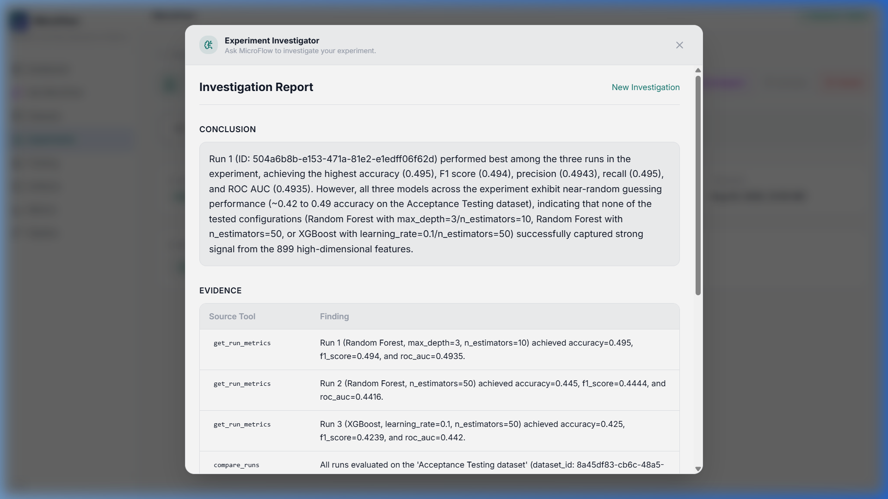

<div align="center">

# MicroFlow


<br>


<br>

<h3><a href="https://microflow-ml-platform.vercel.app">🔗 View Live Demo: microflow-ml-platform.vercel.app</a></h3>

</div>


**A full-stack ML experimentation and observability platform powered by an Agentic AI engineering co-pilot.**

> ### 🔬 Highlight: Experiment Investigator
> Ask any question about your experiment. An autonomous AI agent — built on Gemini's native function calling — plans a multi-step investigation, executes read-only tools against live telemetry, and returns a structured report with evidence provenance. **Grounded in actual experiment telemetry. No hardcoded logic. A real agent loop.**
> [↓ Jump to full details](#-experiment-investigator--agentic-ai-at-the-core)

---

## 🤖 Experiment Investigator — Agentic AI at the Core

> Ask a question about any experiment. The agent autonomously plans, calls tools, evaluates results, and delivers a structured report — without hallucinating.



The **Experiment Investigator** is an autonomous AI agent built with Google Gemini's native function calling. It is not a chatbot. It is a bounded, read-only reasoning loop that decides *which tools to call*, *in what order*, and *when to stop*.

```
User Query
    │
    ▼
┌─────────────────────────────────────────────────────────┐
│                  InvestigatorAgent                       │
│                                                         │
│  ┌──────────┐     ┌───────────────┐     ┌───────────┐  │
│  │  Gemini  │────▶│  Tool Dispatch│────▶│ DB / SHAP │  │
│  │  Flash   │◀────│  (5 tools)    │◀────│  Layer    │  │
│  └──────────┘     └───────────────┘     └───────────┘  │
│       │                                                 │
│  ≤ 5 iterations (hard cap)                              │
│       │                                                 │
│       ▼                                                 │
│  ┌──────────────────────────────────────────────────┐   │
│  │ Structured Report: Conclusion · Evidence · Limits│   │
│  └──────────────────────────────────────────────────┘   │
└─────────────────────────────────────────────────────────┘
```

**5 read-only tools the agent can call:**

| Tool | What it fetches |
|------|----------------|
| `get_experiment_runs` | All runs in the experiment with status |
| `get_run_metrics` | Accuracy, F1, precision, recall, ROC-AUC |
| `get_run_config` | Hyperparameters and model configuration |
| `compare_runs` | Side-by-side delta between any two runs |
| `get_feature_importance` | SHAP values and top contributing features |

**Built-in safety guarantees:** Hard iteration cap (≤5 loops) · Read-only tool access · SHA-256 response caching · 5-model Flash cascade failover · Evidence provenance on every claim.

---

## Platform Features

```
MicroFlow
├── ML Experimentation Platform
│   ├── Dataset Management & Versioning
│   ├── Experiment Tracking (runs, configs, artifacts)
│   ├── SHAP Explainability (summary, dependence, values)
│   └── Paginated Artifact Registry
├── AI Engineering Suite (Google Gemini)
│   ├── Experiment Investigator  ← Agentic, function-calling loop
│   ├── AI Run Review            ← Peer-review per completed run
│   ├── AI Run Comparison        ← Delta analysis across two runs
│   ├── AI Strategy Co-Pilot     ← Chronological experiment guidance
│   ├── AI Dataset Insights      ← Schema audit and quality scoring
│   └── Ask MicroFlow            ← Hybrid RAG assistant + RAGAS eval
└── Infrastructure
    ├── FastAPI backend · React/TypeScript frontend
    ├── PostgreSQL + pgvector (semantic search)
    ├── Docker Compose (3-container stack)
    └── 289+ tests · CI/CD via GitHub Actions
```

---

## Architecture

```
┌──────────────────────────────────────────────────────────┐
│                    React Frontend                         │
│  TanStack Query · TypeScript · Recharts · Tailwind CSS   │
└──────────────────────┬───────────────────────────────────┘
                       │ HTTP / REST
┌──────────────────────▼───────────────────────────────────┐
│                   FastAPI Backend                         │
│                                                          │
│  Routers → Services → Repositories                       │
│                                                          │
│  ┌─────────────┐  ┌──────────────┐  ┌────────────────┐  │
│  │  Training   │  │  AI Layer    │  │  RAG Layer     │  │
│  │  Engine     │  │  (Gemini)    │  │  (pgvector)    │  │
│  │  + SHAP     │  │  + Agent     │  │  + RAGAS eval  │  │
│  └─────────────┘  └──────────────┘  └────────────────┘  │
└──────────────────────┬───────────────────────────────────┘
                       │ SQLAlchemy ORM
┌──────────────────────▼───────────────────────────────────┐
│              PostgreSQL 16 + pgvector                     │
│    Experiments · Runs · Artifacts · AI Cache · Embeddings │
└──────────────────────────────────────────────────────────┘
```

**Key engineering decisions:**
- **Repository Pattern** — No SQL in services. No DB access in the AI layer.
- **Zero-Hallucination AI** — Gemini receives pre-fetched structured data only. No SQL generation. No internet access.
- **Deterministic Caching** — SHA-256 hash of every prompt. Identical queries skip the LLM entirely.
- **Resilience Cascade** — Exponential backoff + 5-model Flash failover on rate limits.

---

## Quick Start

```bash
git clone https://github.com/Mohitingale13/microflow-ml-platform.git
cd microflow-ml-platform
# add GEMINI_API_KEY to .env
docker compose up --build
```

| Service | URL |
|---------|-----|
| Frontend | http://localhost:3000 |
| Backend API | http://localhost:8000 |
| Swagger Docs | http://localhost:8000/docs |

Required `.env` variables:
```
GEMINI_API_KEY=your_google_gemini_api_key_here
POSTGRES_USER=microflow
POSTGRES_PASSWORD=microflow_secret
POSTGRES_DB=microflow
```

> All AI features require `GEMINI_API_KEY`. Without it, AI endpoints return a descriptive 503 while all other platform features remain fully operational.

### Running Tests

```bash
docker compose exec backend pytest -v
```

289+ tests covering services, routers, training, AI layer, and the full Investigator agent spec.

---

## Project Structure

```
microflow-ml-platform/
├── backend/
│   ├── app/
│   │   ├── ai/
│   │   │   ├── investigator_agent.py   # Agentic loop
│   │   │   ├── tools/investigator_tools.py  # 5 read-only tools
│   │   │   ├── gemini_service.py       # Retry + failover
│   │   │   └── cache_service.py        # SHA-256 caching
│   │   ├── routers/                    # HTTP layer only
│   │   ├── services/                   # Business logic
│   │   ├── repositories/               # DB access
│   │   └── training/                   # Model Factory + SHAP
│   └── tests/                          # 289+ tests
├── frontend/
│   └── src/
│       ├── components/experiments/
│       │   ├── InvestigatorModal.tsx
│       │   ├── AIStrategyTab.tsx
│       │   └── CompareRunsDialog.tsx
│       └── components/datasets/
│           └── AIInsightsTab.tsx
├── docker-compose.yml
└── CONTRIBUTING.md
```

---

## Future Improvements

- **Authentication** — JWT + role-based access control
- **Async training jobs** — Celery/ARQ task queue with real-time status
- **Cloud artifact storage** — S3-compatible backend (single service swap)
- **Streaming AI responses** — Token-level streaming for the Investigator
- **Experiment scheduling** — Grid search / random search across hyperparameter spaces

---

## Contributing

See [CONTRIBUTING.md](CONTRIBUTING.md) for architecture conventions, layer rules, and PR guidelines.

---

## License

MIT

---

## Acknowledgements

Inspired by [MLflow](https://mlflow.org), [Weights & Biases](https://wandb.ai), and [Kubeflow](https://kubeflow.org). AI powered by [Google Gemini](https://deepmind.google/technologies/gemini/).


