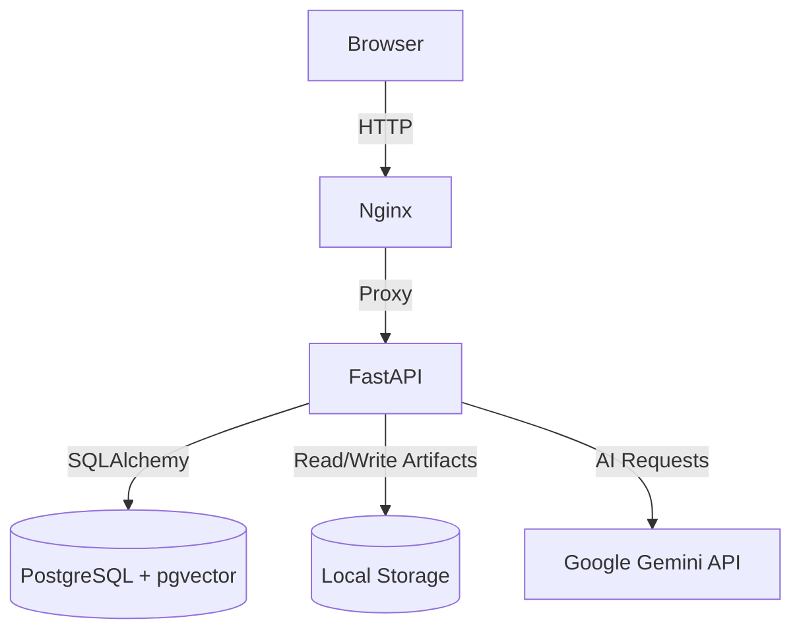
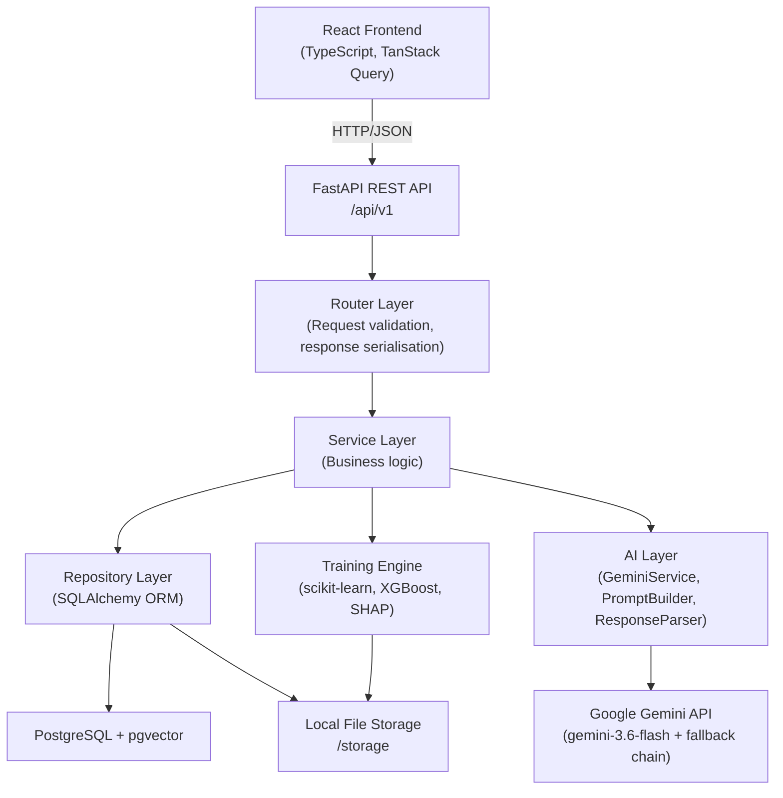
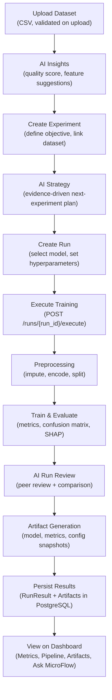

<div align="center">

# MicroFlow


<br>


<br>

<h3><a href="https://microflow-ml-platform.vercel.app">🌟 View Live Demo: microflow-ml-platform.vercel.app 🌟</a></h3>

</div>


**A full-stack ML experimentation and observability platform with an integrated AI engineering co-pilot.**

### Platform Features
- Dataset Management with AI Insights
- Experiment Tracking with AI Strategy Co-Pilot
- Run Tracking with AI Peer Review & Comparison
- Ask MicroFlow — Hybrid RAG Assistant with RAGAS Evaluation Layer
- Training Engine (Random Forest, XGBoost, Logistic Regression) with SHAP Explainability
- Paginated Artifact Registry (50 items/page, sorted by latest)
- Metrics Dashboard
- Pipeline Visualization & Lineage Graph
- Interactive Engineering Dashboard
- Platform Health Monitor

---

## Overview

Running one model once is easy. Running hundreds of experiments over several datasets, comparing results across model configurations, and reproducing a specific run six months later — that is the actual problem.

MicroFlow is a full-stack ML platform designed to solve exactly that. It handles the infrastructure layer of machine learning: dataset versioning, experiment definition, run tracking, artifact persistence, model explainability (SHAP), and metrics aggregation — all backed by an AI engineering co-pilot powered by Google Gemini that operates strictly on authentic experiment telemetry without hallucination.

The platform is aimed at ML engineers, data scientists, and research engineers who need an organised, auditable, and AI-assisted workflow.

---

## Highlights
- Full-stack ML platform — FastAPI + React + PostgreSQL
- 264+ automated backend tests, all passing
- Dockerized, three-container deployment (Nginx + FastAPI + PostgreSQL/pgvector)
- Complete AI Engineering Suite powered by Google Gemini 3.6 Flash
- Automatic exponential backoff & multi-model fallback for AI resilience
- SHA-256 deterministic caching for all AI responses
- LLM-as-a-Judge Evaluation Layer (RAGAS) with intelligent retry and state tracking
- Experiment Investigator — Bounded Agentic ML Investigation Suite
- Global Feature Importance via SHAP integration for all models
- Paginated Artifact Registry with latest-first ordering
- Uniform refresh UX with 500 ms minimum spinner + confirmation badge
- Interactive Metrics Dashboard & Pipeline Visualization

---

## Screenshots

### Dashboard


### Ask MicroFlow — Hybrid RAG Assistant


### Metrics Dashboard


### Pipeline Visualization


---

## Why I built this

Modern ML projects quickly become difficult to reproduce as datasets, models, configurations, and evaluation results grow. MicroFlow was built to explore how an experiment tracking platform can be engineered from scratch using a clean layered architecture, and to answer: *what does it look like when AI is integrated not as a chatbot wrapper but as a grounded, zero-hallucination engineering co-pilot operating strictly on authenticated telemetry?*

---

## Why MicroFlow?

When ML projects move beyond a single experiment, three problems surface reliably:

**You lose track of what you ran.** Without a structured system, experiments accumulate in notebooks. Parameters get changed and forgotten. Results become disconnected from the code that produced them.

**You can't reproduce results.** If the preprocessing pipeline isn't captured alongside the model, retraining on the same data produces a different result. MicroFlow snapshots training configuration and preprocessing metadata with every run.

**Comparison becomes manual work.** Comparing five model configurations across two datasets requires a proper query layer, not a spreadsheet. MicroFlow's Metrics Dashboard provides aggregated, queryable analytics across all runs.

---

## Deployment Architecture



---

## Key Features

### Dataset Management
- Upload CSV datasets through the UI or API
- Automatic schema analysis: row count, column count, data types, missing value detection
- Dataset preview (first N rows) and per-column statistics
- SHA-256 deduplication — the same file will not be stored twice
- Datasets are versioned and protected from deletion if experiments depend on them
- **AI Insights tab** — automated pre-training dataset intelligence (see AI section below)

### Experiment Management
- Experiments define the ML problem: name, objective, linked dataset, and default training configuration
- Multiple runs can be grouped under a single experiment
- Experiment status lifecycle: `draft → active → archived`
- Per-experiment analytics showing best run, accuracy range, and model breakdown
- **AI Strategy tab** — live ML co-pilot generating evidence-driven next-experiment recommendations

### Run Management
- Each run is an individual training execution with its own model type and hyperparameter overrides
- Run status lifecycle: `draft → queued → running → completed / failed`
- Full audit trail: created timestamp, started timestamp, completed timestamp, execution duration
- Run notes and configuration stored as a snapshot for reproducibility
- **AI Run Review** — on-demand peer review generated for any completed run
- **AI Run Comparison** — deep side-by-side analysis of any two runs within an experiment

### AI Engineering Suite (Google Gemini)

All five AI capabilities share a common architecture: **zero hallucination by design**. Gemini never writes SQL, never accesses PostgreSQL directly, and only reasons over structured data objects fetched by the secure repository layer. Every response is cached with a SHA-256 deterministic key.

#### AI Resilience Layer
- Automatic **exponential backoff** with two retry attempts (1.5 s → 3 s) on 503/429 errors
- **Multi-model quota pooling & instant failover**: `gemini-3.6-flash` → `gemini-3.5-flash` → `gemini-3-flash` → `gemini-2.5-flash` → `gemini-2.5-flash-lite` (with zero-delay failover and smart cooldown tracking on rate limits)
- Errors are surfaced to the frontend with full API status context

#### 1. Ask MicroFlow — Hybrid RAG Architecture & Evaluation Layer
Ask MicroFlow is built as a production-style **Hybrid Retrieval-Augmented Generation (Hybrid RAG)** system powered by **PostgreSQL + pgvector** and **Google text-embedding-004**, backed by an **LLM-as-a-Judge RAGAS Evaluator**:

```
User Question
      │
      ▼
Intent Detection
      │
      ├───────────────────────────────┐
      ▼                               ▼
Structured Retrieval          Semantic Retrieval
(SQL Repositories)            (pgvector / text-embedding-004)
      │                               │
      └───────────────┬───────────────┘
                      ▼
               Context Builder
                      │
                      ▼
                   Gemini
                      │
                      ▼
        Grounded Answer + Sources Used
```

- **Dual-Retrieval Pipeline**: Combines structured database SQL queries with pgvector semantic similarity search (`<=>` cosine distance) over unstructured engineering narratives.
- **Sources Attribution**: Displays an interactive **"Sources Used"** drawer in the UI allowing users to inspect matched semantic knowledge snippets.
- **RAG Evaluation Layer (RAGAS)**: An automated evaluation service that rigorously grades the assistant's responses across three metrics (Context Relevance, Faithfulness, and Answer Relevance). It includes a robust retry state machine (transitions from `pending` to `pending + retry` to `failed` up to 3 times) to isolate failures and accurately manage evaluation batches.

Every response delivers five structured fields:
| Field | Description |
|---|---|
| **Analysis & Findings** | The direct, engineering-grade answer grounded in structured telemetry & retrieved semantic documents |
| **Reasoning** | How the AI reached its conclusion based on dual-retrieval context |
| **Telemetry Evidence** | The raw experiment data backing the answer |
| **Suggested Next Step** | The single recommended action to take |
| **Sources Used** | Interactive pgvector semantic document snippets retrieved for RAG context |

Session context carries forward across queries within the same page visit.

#### 2. AI Experiment Strategy
Integrated as a `✨ AI Strategy` tab inside each experiment. Operates as an authoritative ML co-pilot:
- Synthesizes dataset quality metrics, metric variance, chronological run trajectories, speed comparisons, and parameter space coverage
- Maps unexplored model families and unvisited hyperparameter regions
- Identifies metric saturation and plateau conditions
- Recommends the single best next experiment with concrete algorithm families and parameter bounds

#### 3. AI Dataset Intelligence
Integrated as a `✨ AI Insights` tab inside each dataset. Runs automated pre-training auditing:
- Deterministic quality score (0–100) grounded in actual missing value ratios, volume adequacy, and feature completeness
- Optimal target variable and feature suggestions from column schema analysis
- Algorithm suitability ratings (Random Forest, XGBoost, Logistic Regression)
- Step-by-step preprocessing roadmap

#### 4. AI Run Review
On-demand peer review for any completed run:
- Overall assessment, identified strengths and weaknesses
- Comparison against the current best run in the experiment
- Concrete next steps for improving performance

#### 5. AI Run Comparison
Deep analysis comparing any two completed runs within an experiment:
- Configuration attribution — which hyperparameter changes drove metric differences
- Explicit trade-off analysis (accuracy vs. speed vs. generalization)
- Actionable improvement strategies with specific parameter suggestions

#### 6. Experiment Investigator
An agentic investigation suite that operates over existing experiment data.
- **Bounded execution**: Operates with a hard-capped `MAX_AGENT_ITERATIONS = 5` limit.
- **Strictly read-only**: Uses exactly 5 explicitly exposed tools (`get_experiment_runs`, `get_run_config`, `get_run_metrics`, `compare_runs`, `get_feature_importance`). The agent cannot modify experiments, models, or database state.
- **Dynamic Selection**: Utilizes native Gemini function calling to decide which tools to execute based on the user's natural language objective.
- **Request-Scoped**: The agent maintains state only for the duration of the request, with no persistent memory or arbitrary SQL generation.
- **Structured Output**: Produces a structured, evidence-backed `InvestigationReport` detailing conclusions, evidence, recommendations, and limitations.

### Training Engine & SHAP Explainability
- Supports three model families: **Random Forest**, **Logistic Regression**, **XGBoost**
- Preprocessing pipeline: missing value imputation (median/mode), one-hot encoding, stratified train/test split
- **SHAP Explainability**: Automatically calculates global SHAP feature importance values during evaluation, persisting them for the frontend to visualize exactly which features drove the model's predictions.
- Model Factory pattern — adding a new estimator requires changes in one file only
- All training logic is HTTP-free; the engine communicates through plain Python interfaces

### Artifact Registry
- Every completed run generates six artifact files automatically:
  - Trained model (serialised)
  - Metrics JSON, Evaluation JSON, Confusion Matrix JSON
  - Preprocessing Summary JSON, Training Configuration Snapshot JSON
- **Paginated display**: 50 artifacts per page, sorted latest-first, with Previous/Next controls
- SHA-256 checksum stored with every artifact for integrity verification
- Artifacts can be downloaded directly from the UI or API

### Metrics Dashboard
- System-wide overview: total runs, success rate, average accuracy, average F1, average ROC AUC
- Model leaderboard: best accuracy and average accuracy grouped by model family
- Experiment performance table: best run, accuracy range, model breakdown per experiment
- Dataset performance analytics: which datasets produce the best models
- Side-by-side run comparison: select any N runs and compare configurations and metrics

### Pipeline Visualization
- Per-run execution graph showing all eight pipeline stages
- Each node shows status, timestamps, and duration
- Chronological timeline view for a selected run
- Global lineage view: Dataset → Experiments → Runs → Artifacts, rendered as a collapsible tree

### Engineering Dashboard
- Platform-wide overview: 8 live stat cards
- Recent activity feed showing the last 5 platform events across all modules
- Recent runs table with status badges, model labels, accuracy, and clickable links
- Best performing assets: best model family, best experiment, most-used dataset, latest artifact
- **Platform Health Monitor** — live service status with version indicator (v1.0.0)

### UX & Reliability
- **Uniform refresh UX**: all refresh buttons across the platform feature a 500 ms minimum spinner and an emerald "Updated!" / "Checked!" confirmation badge
- **Spacious count bars**: all "Showing X of Y" result count bars use structured flex layouts with clean spacing between words and numbers
- **Developer-first copy**: concise, engineering-grade UI language throughout (no chatbot filler text)
- **Mobile-first layouts**: all changes are responsive and mobile-compatible

---

## System Architecture



Each layer has exactly one responsibility. Routers never touch the database. Services never call HTTP directly. Repositories never contain business logic. The training engine has no knowledge of FastAPI or SQLAlchemy. The AI layer never writes SQL or accesses the database — it only receives pre-fetched, structured data objects.

---

## ML Workflow



---

## Technology Stack

| Layer | Technology |
|---|---|
| **Frontend** | React 18, TypeScript, Vite |
| **Styling** | Tailwind CSS v4 |
| **Data Fetching** | TanStack Query (React Query) |
| **Routing** | React Router v6 |
| **Charts** | Recharts |
| **Backend** | FastAPI, Python 3.11 |
| **ORM** | SQLAlchemy 2.0 (mapped columns) |
| **Validation** | Pydantic v2 |
| **Database** | PostgreSQL 16 + pgvector |
| **AI Engine** | Google Gemini 3.6 Flash (with 5-model Flash quota pooling & cooldown failover) |
| **ML** | scikit-learn, XGBoost, pandas, NumPy, SHAP |
| **Infrastructure** | Docker, Docker Compose, Nginx |
| **Testing** | pytest, SQLite in-memory (StaticPool) |

---

## Project Structure

```
MicroFlow/
├── backend/
│   ├── app/
│   │   ├── ai/             # AI layer: GeminiService, PromptBuilder, ResponseParser
│   │   ├── api/            # Router registration
│   │   ├── core/           # Config, logging
│   │   ├── db/             # Session management, base model
│   │   ├── models/         # SQLAlchemy ORM models
│   │   ├── repositories/   # Database access layer (incl. AI cache repos)
│   │   ├── routers/        # FastAPI route handlers
│   │   ├── schemas/        # Pydantic request/response models
│   │   ├── services/       # Business logic (incl. AI services & Evaluation)
│   │   ├── training/       # ML pipeline (loader, preprocessor, factory, trainer, evaluator)
│   │   └── main.py
│   ├── tests/
│   │   ├── services/       # Service unit tests
│   │   ├── training/       # Training engine unit tests
│   │   ├── test_ai_review.py
│   │   ├── test_ai_dataset_insights.py
│   │   ├── test_run_comparison.py
│   │   ├── test_dashboard.py
│   │   ├── test_metrics.py
│   │   └── test_pipeline.py
│   └── alembic/            # Database migrations
├── frontend/
│   └── src/
│       ├── components/
│       │   ├── ai/         # AIReviewCard
│       │   ├── dashboard/  # PlatformHealth, RecentRuns, etc.
│       │   ├── datasets/   # AIInsightsTab, PreviewTable
│       │   └── experiments/# AIStrategyTab, CompareRunsDialog
│       ├── hooks/          # TanStack Query hooks
│       ├── layouts/        # AppLayout, Sidebar, Navbar
│       ├── pages/          # One page per feature
│       ├── services/       # API client functions
│       ├── types/          # TypeScript interfaces
│       └── utils/          # Shared helpers
├── docker/
│   └── postgres/           # DB init scripts
├── docs/
│   ├── PROJECT_SPEC.md
│   ├── ARCHITECTURE.md
│   └── ROADMAP.md
├── images/                 # README screenshots
├── storage/                # Artifact file storage (volume-mounted)
└── docker-compose.yml
```

---

## Running Locally

### Requirements

- Docker and Docker Compose
- A Google Gemini API key (for AI features)
- No local Python or Node.js installation required

### Start with Docker Compose

```bash
git clone https://github.com/Mohitingale13/microflow-ml-platform.git
cd microflow-ml-platform
docker compose up --build
```

| Service | URL |
|---|---|
| Frontend | http://localhost:3000 |
| Backend API | http://localhost:8000 |
| API Docs (Swagger) | http://localhost:8000/docs |
| API Docs (ReDoc) | http://localhost:8000/redoc |

### Environment Variables

Copy `.env.example` to `.env` and configure:

```
POSTGRES_USER=microflow
POSTGRES_PASSWORD=microflow_secret
POSTGRES_DB=microflow
LOG_LEVEL=INFO
ENVIRONMENT=development
GEMINI_API_KEY=your_google_gemini_api_key_here
```

> The `GEMINI_API_KEY` is required for all AI features (Ask MicroFlow, AI Strategy, AI Insights, AI Run Review, AI Run Comparison). Without it, AI endpoints will return a descriptive 503 error while all other platform features remain fully functional.

### Running Tests

```bash
docker compose exec backend pytest -v
```

The test suite uses SQLite in-memory databases with SQLAlchemy's `StaticPool` — no external PostgreSQL connection required. **264 tests** currently pass across all modules.

### Development (without Docker)

```bash
# Backend
cd backend
pip install -r requirements.txt
GEMINI_API_KEY=your_key uvicorn app.main:app --reload

# Frontend
cd frontend
npm install
npm run dev
```

---

## Engineering Decisions

**Repository Pattern**
Every database table has a dedicated repository class. Services call repositories; they never write SQLAlchemy queries directly. This makes services testable in isolation by substituting a mock repository without touching a database.

**Service Layer**
All business logic lives in services. Routers handle HTTP concerns only. The AI services follow the same pattern — they receive pre-fetched data objects from the repository layer and pass structured prompts to the AI layer.

**AI Zero-Hallucination Architecture**
Gemini is never given access to the database. The `AssistantService` fetches all relevant data through authenticated repository methods, injects it as structured context into the prompt, and asks Gemini to reason over it. There is no SQL generation, no tool calling, and no external data access. Every claim Gemini makes is traceable to a specific database record fetched before the prompt was constructed.

**AI Deterministic Caching**
All AI responses are cached by a SHA-256 hash of the input prompt. Identical queries (same run, same data state) return instantly from the cache without calling Gemini. The cache is persisted in PostgreSQL so it survives restarts.

**AI Resilience Layer**
The `GeminiService` wraps every API call with exponential backoff retry logic for 503 high-demand spikes and smart instant failover for rate limit or quota exhaustion. If a model reaches its RPM or RPD limit (429 / resource exhausted), the service records a cooldown timestamp and transitions with zero sleep delay across a 5-model Flash cascade (`gemini-3.6-flash` → `gemini-3.5-flash` → `gemini-3-flash` → `gemini-2.5-flash` → `gemini-2.5-flash-lite`).

**Run vs Experiment separation**
An experiment defines the problem. A run is one attempt at solving it. This separation allows multiple model configurations and hyperparameter sweeps to be grouped meaningfully under a single experiment.

**Artifact persistence**
Artifacts are written to disk as real files and registered in the database with checksums. This means they can be downloaded, re-used, and verified for integrity independently of the application.

**Why metrics are persisted**
Metrics are stored in `RunResult` as typed database columns, not as JSON blobs. This allows the metrics repository to run SQL aggregations without deserialising data in application code.

**Why Docker**
The project runs as three containers: PostgreSQL (with pgvector), the FastAPI backend, and a Nginx-served React frontend. Docker Compose with health checks ensures services start in the correct order.

**Why TanStack Query**
All server state on the frontend is managed by TanStack Query. This provides automatic caching, background refetching, and a clean separation between server state and local UI state.

---

## Future Improvements

- **Authentication and multi-user support** — JWT-based auth with role-based access control
- **Background training jobs** — move to a task queue (Celery, ARQ) for async training with real-time status polling
- **Cloud object storage** — swap artifact storage backend for S3-compatible storage (requires only `ArtifactService` changes)
- **Additional model families** — the Model Factory accepts new estimators by adding a single builder function
- **Experiment scheduling** — queue a batch of runs with different hyperparameter combinations (grid search, random search)
- **Streaming AI responses** — stream Gemini tokens to the frontend for a real-time reasoning experience
- **AI-powered anomaly detection** — proactively flag metric regressions or unexpected training behaviour across runs

---

## Contributing

We welcome contributions from the open-source community! 

Please see our [CONTRIBUTING.md](CONTRIBUTING.md) for detailed guidelines on how to set up your development environment, run tests, and submit pull requests.

### Before opening a PR:
- Run `pytest -v` and ensure all tests pass.
- Follow the existing layer conventions: routers call services, services call repositories.
- Keep business logic in services (not routers), and never add database access to the AI layer.
- Ensure any new UI components are responsive and mobile-first.
- Add tests for any new service or repository method.

---

## License

MIT

---

## Acknowledgements

Inspired by the engineering principles behind [MLflow](https://mlflow.org), [Weights & Biases](https://wandb.ai), and [Kubeflow](https://kubeflow.org). AI powered by [Google Gemini](https://deepmind.google/technologies/gemini/). MicroFlow is not affiliated with any of these projects.
